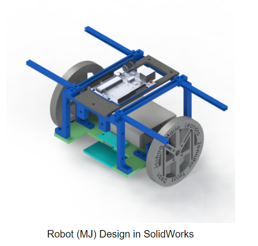
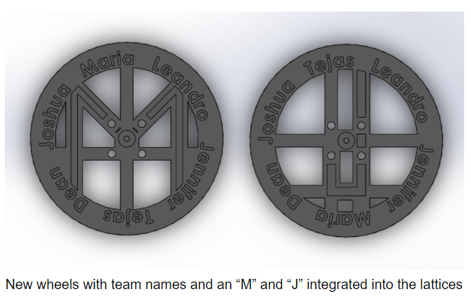
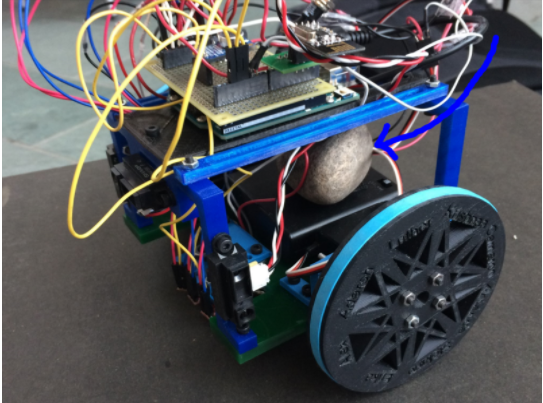
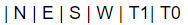
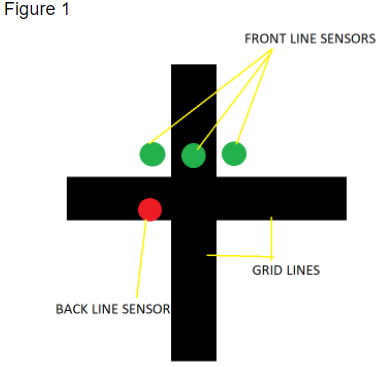
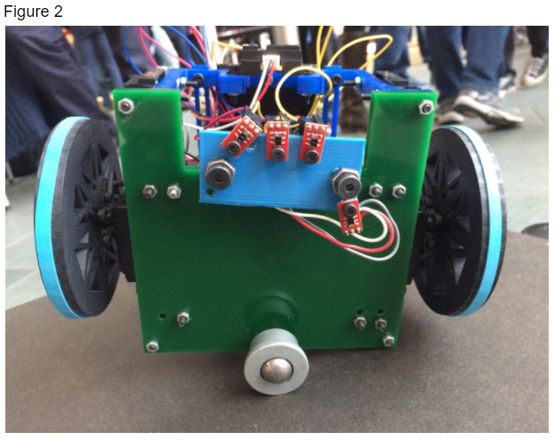

## Final Design of MJ

### Introduction
The labs have ended and it’s time for MJ to see his (or her) final form! Team 10’s last few weeks of the semester were spent integrating all of the subsystems built in the individual labs and milestones to prepare MJ for his world debut at the ECE 3400 competition. This included: preparing a new mechanical frame for the robot, building an intelligent maze-mapping algorithm, enabling treasure detection, configuring the base station, and communicating the robot with said base  station effectively. Many of these things resulted in complication when faced against the task of integration, and many hours of debugging were spent remedying those issues. In the end, although not every part was able to be combined perfectly, many pieces worked well in tandem and with more debugging would definitely produce an effective maze-mapping robot.
### Mechanical Design

#### Overall Design ####



As we progressed through the various labs and milestones, we noticed our line following quality was degrading. We were using two line sensors for both line and intersection detection. To improve the line following of the robot, we wanted to add more sensors in various orientations, but the current chassis we were using did not allow for easy testing of these different orientations. In addition, we wanted to make the line sensors digital signals to conserve our limited resource of analog pins, so the line sensors had to be very close to the ground to read accurate values to send valid data.

Because of these issues, we decided to redesign the entire robot. A new chassis was laser cut to fit the new 3D printed brackets that held the robot closer the the ground. The chassis stood about an inch off the ground, allowing the line sensors to get much closer to the ground. The line sensor bracket itself had a wide base that allowed for varying sensor orientations that could change just by measuring and drilling new holes. More than one of these brackets were printed to allow for the possibility of swapping between different line sensor orientations.

The wall sensors were all placed on the front “shelf” bracket. The front line sensor had its own extrusion while the side sensors happened to fit on the sides of the bracket. This was easy to mount and kept the wall sensors relatively out of the way of the wires and wheels.


For the treasure circuits, four sliding brackets were designed to account for the unfinalized version of the circuits. The position of the treasure sensor could be moved because the brackets would slide on a shelf mount and then were secured by tightening the screw through it. This feature was not utilized due to the treasure circuit changing in design, as well as treasure detection not being implemented in the final competition.

Then, the wheels were left unchanged in size; only the internal design was modified. Finally, the servo mounts were changed as well, just to interface better with the low-to-the-ground design.



#### Encountered Problems ####

The main reason this mechanical design suffered was its untested iterations. The design itself was finalized less than a week before the competition which greatly affected our team’s overall system. This meant any problems that arose could not easily be solved due to time constraints.

The design itself could have been improved by making the pieces easier to integrate. A couple of brackets had holes that were not easy to access with screws or nuts. This was especially evident with the line sensor bracket that was short and had several screws going through it that were hard to reach by hand.
Also, the line sensor bracket ended up being too close to the ground so rubber bands had to be used on the wheels to raise them up, but this led to the robot slipping occasionally. In addition, there was no front support to the robot and it tended to lean and shake forward. To give it more support, two large screws were put into the line sensor bracket so they would stop the robot as it would lean forward. This was not ideal because the sensor bracket was not meant to be structural.

##### Bucking Prevention - The Rock #####
 In the final iteration of our design, the weight of the robot was unevenly distributed. This resulted in the robot tilting forward when it jerked to a stop, which was throwing off the line sensor readings and navigation algorithm. To address this, Maria velcroed a rock to the battery pack towards the back of the robot, which improved performance. Unfortunately, we still had a significant amount of jitter, making movement rough and occasionally messing up the algorithm. 



### Treasure Sensor Circuit Design
In the final competition of design, we made additional changes to our previous treasure detection circuit. In our previous design, we made two separate circuits the  for two phototransistors. This creates problem for the robot’s mechanical design as it is would require additional mechanical work to stabilize the circuit and balance the robot if we have separate circuits on the side of the robot. It would also require two pins on the arduino uno. Therefore to minimize pins used and circuit used, we used a single filter and amplifier for the final circuit. Two inputs from the phototransistors are connected in parallel and analyzed.

In addition, although the previous design in Milestone4 had dramatically increased the range of detection (about 15 cm), it made the phototransistor possible to detect treasures that are not on the current grid. Therefore we decided to decrease the amplification and increase the threshold for the FFT results. The final set of resistors used on the robot are 100Ω and 75kΩ, which could reliably detect treasures within distance of 10cm, and ignore treasures from further distance.

The picture below is the treasure circuit with one phototransistor plugged in:


Here’s a schematic of our final treasure circuit (the circuit model software does not have symbols for phototransistors, so I used the symbol of photodiodes instead)


### Maze-Mapping Algorithm
Our final maze-mapping algorithm which was present on the robot was very similar to the algorithm used by Team Alpha since we had to prioritize improving the stability of the physical movement of the robot and also tackle the issue of board shutdown. We utilized a simple DFS algorithm for mapping the maze. Since we didn’t have time to debug and optimize the algorithm as well as the robot movement with a new chassis, we made simple modifications to the code provided by Team Alpha in order to guarantee the presence of a working algorithm for the new design.

The maze is represented as a 5x4 matrix with each entry of the ith column and jth row of the matrix representing the node data (wall and treasure) at the ith and jth row of the actual maze.

Each node is given a label or an ID as following:
``` c
NodeID= 4 * y + x;
```
Where y and x correspond to the y and x coordinates of the node on the maze. The convention of coordinates for the nodes that we follow defines the top left node as (0,0), the node present on the right and on the bottom to it as (1,0) and (0,1) respectively. This creates labels for the node starting from 0 to 19. On the maze, we define the absolute north direction as the direction in which the row containing (0,0) is the top most row.

By following this convention and the above method to define IDs for the nodes, we can extract the coordinates of any node using just their label using the following functions:

```c
 int get_y(int NodeID) {
  return NodeID / 4;
}

int get_x(int NodeID) {
  return NodeID % 4;
}
```
Each entry of the maze stores data in the form of a binary number of the format 


Where N, E, S, and W represent the information regarding walls in the north, east, south, and west direction respectively. 1 means a wall is present while 0 means no wall. And T1 and T0 represent the information regarding the treasure frequency. 0|0 corresponds to presence of no treasure, 0|1 corresponds to 7 kHz, 1|0 to 12 kHz, and 1|1 to 17 kHz.

So for example, if node 2 has walls in the absolute north and the absolute west direction and a 7 kHz frequency treasure, maze[0][2] will contain the binary number 100101 which is nothing but the decimal number 37.

This was the idea, however, since we could not integrate our treasure sensors onto the robot, we removed the T1 and T0 values.

Various initializations had to be made to incorporate for the “known-walls” or the boundary walls which can be assigned to the outer-most nodes.

```c
void initialize_known_walls() {
  known_walls[0]  = 9; // 1001
  known_walls[1]  = 1; // 1000
  known_walls[2]  = 1; // 1000
  known_walls[3]  = 12; // 1100
  known_walls[4]  = 1; // 0001
  known_walls[5]  = 0; // 0000
  known_walls[6]  = 0; // 0000
  known_walls[7]  = 4; // 0100
  known_walls[8]  = 1; // 0001
  known_walls[9]  = 0; // 0000
  known_walls[10] = 0; // 0000
  known_walls[11] = 4; // 0100
  known_walls[12] = 1; // 0001
  known_walls[13] = 0; // 0000
  known_walls[14] = 0; // 0000
  known_walls[15] = 4; // 0100
  known_walls[16] = 3;// 0011
  known_walls[17] = 2; // 0010
  known_walls[18] = 2; // 0010
  known_walls[19] = 6; // 0110
}
```
At every node, the wall sensors tell the robot of the presence of walls and this updates the maze matrix. Using the maze matrix, known walls and the starting position (node 19) along with starting orientation (north), the robot carries out simple DFS as described on Team Alpha’s Milestone 3 webpage.

#### Better Line Following and Turning

In order to make our line following and 90 degree turns robust, we decided to use four sensors instead of 2, like we had been using previously - 3 at the front for line following and 1 at the back for detecting intersections as shown in figure 1 and 2.





Also, we took digital input from the sensors instead of analog to save analog pins and avoid multiplexing. To facilitate proper functioning of the sensors, we had to bring them closer to the ground. With a new sensor setup, we had to create new logic for line following and turning.
A digital value of 1 corresponds to the sensor detecting black while a 0 corresponds to the sensor detecting white

Logic for line following (pseudocode):
 ```c
 while (back_sensor does not read 1 ) {
    if (middle_sensor reads 1 && left_sensor reads 0 && right_sensor reads 0) {
     go straight;
    }
    else if (middle_sensor reads 1 && left_sensor reads 1 && right_sensor reads 0) {
      make a slight left turn;
    }
    else if (middle_sensor reads 1 && left_sensor reads 0 && right_sensor reads 1) {
     make a slight right turn;
    }
    else if (middle_sensor reads 0 && left_sensor reads 1 && right_sensor reads 0) {
      make a strong left turn;
    }
    else if (middle_sensor reads 1 && left_sensor reads 0 && right_sensor reads 0) {
      make a strong right turn;
    }
    else {
      go straight;
    }
 ```
Once the back sensor detects an intersection, the robot can either continue moving in the same direction, or make a 90 degree turn in either right or left direction, or completely turnaround.

Logic for hard right turn (pseudocode):
```c
//Firstly, the front sensors have to get off the black line by turning in the right direction
  while (middle_sensor reads 1 || left_sensor reads 1){
make a right turn; 
}
//Next, the robot needs to keep turning right till it encounters a new line
  while (!(middle_sensor reads 1 && left_sensor reads 1)){
	make a right turn;
}

Similarly, we get the following logic for making a hard left turn:

//Firstly, the front sensors have to get off the black line by turning in the left direction
  while (middle_sensor reads 1 || right_sensor reads 1){
make a left turn; 
}
//Next, the robot needs to keep turning left till it encounters a new line
  while (!(middle_sensor reads 1 && left_sensor reads 1)){
	make a left turn;
}
```

Using this new system, we could significantly improve the line following and 90 degree turning of our robot. For turning around, our robot makes two consecutive right turns.
All of this pseudocode was easily translated to Arduino code by using the existing movement functions from previous milestones.

### Base Station


We were able to assemble a fully-functioning base station. We decided to use parallel communication between the Arduino and FPGA (described in lab 4), as data is sent faster and it is easier to program.

#### Arduino
We ended up using 17 bits to send all of the maze information (x and y current, x and y last, treasures, walls, and the done signal). Since we also needed to attach the radio, the Arduino Uno’s 20 analog/digital pins weren’t going to cut it. We decided to upgrade to the Mega board. At first, we set the radio on the Mega up the same way it was configured on the Uno in lab 4, but it wasn’t able to receive the transmission from the Uno. After looking at the pin configuration, we realized that the SPI pins were in a different location on the Mega. After rewiring the board and updating the code with the new pins, we were able to send and receive maze information over radio. The robot sent the maze information in a 32-bit packet, of which only the 17 least significant bits were used.


Once the base station received the packet from the robot, it sent it to the FPGA by writing to the digital pins in a for loop over each bit of the message. A valid bit (pin 32) was used to tell the FPGA to sample the signals after they had all been sent, so they weren’t sampled while they were still in flux, which could cause errors in the display.

Code: 
``` 
    void write_new_data(unsigned long new_data){
/*Writes new_data to digital pins 53-23 w/ the following mapping
New_data: b16 | b15 | b14 | b13 | b12 | b11 | b10 | b9 | b8 | b7 | b6 | b5 | b4 | b3 | b2 | b1 | b0
d_pins: 33 |  34 |  35 |  36 |  37 |  38 | 39  | 40 | 41 | 42 | 43 | 44 | 45 | 46 | 47 | 48 | 49
data: x1 |  x0 |  y2 |  y1 |  y0 |  T1 | T0  | NW | EW | SW | WW |xL1 | xL0| yL2| yL1| yL0| Dn
 */
  unsigned long mask = 0b00000000000000010000000000000000;
  for (int i = 33; i<=49 ; i++){
      if(new_data & mask){
        digitalWrite(i,HIGH); 
      }
      else{
        digitalWrite(i,LOW);   
      }
      mask >>= 1;
    }
    printf("\n");
    delay(10);
    digitalWrite(32, HIGH);
    delay(100);
    digitalWrite(32,LOW);
    delay(1000);
  }

```
#### FPGA
We were able to expand the Verilog code from milestone 4 to display the entire maze, using the same scheme described in milestone 4 (a 9x11 matrix to represent the 4x5 maze).

We used assign statements to read the information sent from the arduino:
```
assign north = GPIO_1_D[8];
assign east = GPIO_1_D[9];
assign south = GPIO_1_D[10];
assign west = GPIO_1_D[11];
assign treasure_in[1] = GPIO_1_D[6];
assign treasure_in[0] = GPIO_1_D[7];
//	
assign xcoord[1] = GPIO_1_D[1];
assign xcoord[0] = GPIO_1_D[2];
assign ycoord[2] = GPIO_1_D[3];
assign ycoord[1] = GPIO_1_D[4];
assign ycoord[0] = GPIO_1_D[5];
assign x_last[1] = GPIO_1_D[12];
assign x_last[0] = GPIO_1_D[13];
assign y_last[2] = GPIO_1_D[14];
assign y_last[1] = GPIO_1_D[15];
assign y_last[0] = GPIO_1_D[16];
```

As we expanded the maze from the original 2x2 grid, the display would occasionally mis-assign treasures, or show multiple current positions, or throw up rogue walls. The weirdest part of this bug was that it would only happen ~20% of the time, and the other 80% of the time it worked fine. We were finally able to solve this issue by using a valid bit to make sure we were only updating the maze information after all of the signals from the arduino had been set.
```
if (reset == 1'b1)begin
	//initialize maze to unvisited, show exterior walls
end
else if (validbit == 1'b1) begin
	//update the maze matrix with new position information

	//update maze x and y coordinates
	maze_x = 2*xcoord + 1;
	maze_y = 2*ycoord + 1;
			
	maze_xlast = 2*x_last + 1;
	maze_ylast = 2*y_last + 1;
		
	//record treasure information in the treasure matrix
	treasure[xcoord][ycoord] = treasure_in;
	
//any variable ending with c is an 8-bit RGB color corresponding to that description
//assign walls	
	if(north) begin
maze[maze_x][maze_y-1] = wallc; end
	else begin
		maze[maze_x][maze_y-1] = unvisitedc; end
			
	if(south)begin
		maze[maze_x][maze_y+1] = wallc; end
	else begin
		maze[maze_x][maze_y+1] = unvisitedc; end
		
	if(east) begin
		maze[maze_x+1][maze_y] = wallc; end
	else begin
		maze[maze_x+1][maze_y] = unvisitedc; end
		
	if(west) begin
		maze[maze_x-1][maze_y] = wallc; end
	else begin
		maze[maze_x-1][maze_y] = unvisitedc; end
	
//set the color of the center square depending on the state		
	if(treasure[x_last][y_last]==2'b00) begin //no treasure
		maze[maze_xlast][maze_ylast] = visitedc; end //set as visited
	else if(treasure[x_last][y_last]==2'b01) begin //treasure 1
		maze[maze_xlast][maze_ylast] = treasure1c; end //set as treasure 1
	else if(treasure[x_last][y_last]==2'b10) begin //treasure 2
		maze[maze_xlast][maze_ylast] = treasure2c; end //set as treasure 2
	else if(treasure[x_last][y_last]==2'b11) begin //treasure 3
		maze[maze_xlast][maze_ylast] = treasure3c; end //set as treasure 3

end
else if (validbit == 1'b0) begin
	//don’t change anything
maze_x = maze_x;
maze_y = maze_y;
			
maze_xlast = maze_xlast;
maze_ylast = maze_ylast;
		
treasure[xcoord][ycoord] = treasure[xcoord][ycoord];
end
```

Drawing the maze for coordinate 0,0:
```
//coordinate 0,0
if(PIXEL_COORD_X <= 2 && PIXEL_COORD_Y <= 75) begin //west wall
		pixel_color <= maze[0][1]; //set pixel color to the color in the maze matrix
end
else if(PIXEL_COORD_X >=3 && PIXEL_COORD_X <= 72 && PIXEL_COORD_Y <= 2) begin //north
		pixel_color <= maze[1][0]; 
end
else if(PIXEL_COORD_X >= 73 && PIXEL_COORD_X <= 77 && PIXEL_COORD_Y <= 75) begin //east
		pixel_color <= maze[2][1]; 
end
else if(PIXEL_COORD_X >= 3 && PIXEL_COORD_X <= 72 && PIXEL_COORD_Y >= 73 && PIXEL_COORD_Y <= 77) begin //south
		pixel_color <= maze[1][2];
end		
else if(PIXEL_COORD_X>=3 && PIXEL_COORD_X<= 72 && PIXEL_COORD_Y >=3 && PIXEL_COORD_Y <= 72) begin //inner square
		pixel_color <= maze[1][1];
end
```

#### Integration & Testing
We integrated the audio code from Lab 3 for the done signal, and wrote code for an arduino to simulate the robot sending information over radio. We also hooked up the microphone circuit to the same arduino to test the start signal.

Arduino simulation code:
```
//Collect data to be sent (Simulation)
    x_coord = get_x_coord(i); //these hold hard-coded values
    y_coord = get_y_coord(i); 
    pos_data = get_pos_data(i); //pos data holds treasure and wall info
    
    if(i == 25){
      DONE = 1;
    }
    if(i<26){
      i = i+1;
    } 
    
    // Pack the bits into a single 32 bit message 
    unsigned long new_data = packdata(x_coord, y_coord, x_coord_last, y_coord_last, pos_data, DONE);

    // Save the previous coordinates for the next iteration
    x_coord_last = x_coord;
    y_coord_last = y_coord;
    
    // Take the time, and send it.  This will block until complete
    printf("Now sending new map data\n");
    bool ok = radio.write( &new_data, sizeof(unsigned long) );
    if (ok)
      printf("ok...");
    else
      printf("failed.\n\r");
```

Here's a video of our completed simulation on the base station:

<iframe width="560" height="315" src="https://www.youtube.com/embed/3dvZtSK8KO0" frameborder="0" gesture="media" allow="encrypted-media" allowfullscreen></iframe>

### Robot Cost
- 4 Line sensors: $12
- 3 IR distance sensors: $21
- 2 Parallax servos: $26
- [Arduino Mega](https://www.walmart.com/ip/Mega-2560-R3-REV3-ATmega2560-16AU-Board-USB-Cable-Compatible-For-Arduino/783158877?wmlspartner=wlpa&selectedSellerId=13978&adid=22222222227109229890&wl0=&wl1=g&wl2=c&wl3=233508035254&wl4=pla-384449620960&wl5=9005779&wl6=&wl7=&wl8=&wl9=pla&wl10=117875654&wl11=online&wl12=783158877&wl13=&veh=sem): $10.99
Total cost: $69.99


### Conclusion/Lessons Learned
Through this course, we have broadened our knowledge of circuit design, algorithm development, verilog coding/VGA display, signal processing, mechanical prototyping, teamwork, and much more. While our robot did not successfully complete the final maze, we had a great time and learned a lot from this experience.

Here are a few lessons we learned the hard way:
1. Integrate, Integrate, Integrate - We completely underestimated the amount of time we would need to successfully integrate individual components. After getting one thing working, we would set it aside and move on to the next task. This left a huge amount of work for us to do at the end. Integrating components as we went would have been a better strategy.
2. Communication is key -  We were not the best at communicating with each other, especially when it came to coordinating/delegating tasks. None of us were coordinators according to our Belbin team roles, and weekly leadership was not the strongest. This is something we can be mindful of moving forward.
3. Don’t be afraid to ask for help! - Kirsten, the TA’s, and peers are great resources to go to.


[Return To Main Page](index.md)

