<<<<<<< HEAD
# Lab 2: Analog Circuitry and FFTs

## Objective
Now that we’ve got our robot moving, we want it to be able to sense the surrounding environment. In this lab, we were working with a microphone to detect the 660 Hz start signal and an IR sensor to identify treasures of different frequencies.

## Materials
Arduino Unos
Electret microphone
IR receivers
Treasure board
Resistors
Capacitors
Op-amps

## Part 1: FFTs
In this lab, we needed to be able to distinguish between signals of different frequencies. We used the Fast Fourier Transform (FFT) algorithm in Open Music Lab’s FFT library to accomplish this. A Fourier transform takes a signal in the time domain and breaks it down into its component frequencies. An FFT works by splitting an N point time domain signal into N individual time domain signals, calculating the frequency spectra of each, and then merging them into a single frequency spectrum. This is a sped-up version of a Discrete Fourier Transform (DFT).
For this lab, we used Open Music Labs’ FFT library to analyze the signals from our sensor. After downloading and installing the library, we opened up the fft_adc_serial.ino sample code to get a better understanding of how the library worked. This program takes 256 samples from the ADC and places them in even bins (odd bins are used for the complex signal components - since we are only dealing with real signals, odd bins are excluded). The program then processes the data in the fft and sends it out over the serial monitor, in the form of a histogram. Each bin represents a frequency range, determined by the ADC clock frequency.
To verify that the library was working as expected, we hooked our adc up to a function generator and tested it using a 10 kHz signal.

The peak occurs at bin 68, pretty close to the expected bin of 66. Our prescaler was set to 32, giving us an ADC clock frequency of 500  kHz (16 MHz/ 32), and a sampling frequency of 500kHz/13 = 38 kHz. Each bin is about 150 Hz wide, and 10k/150 = 66.
Part 2: Acoustic Team
The microphones we used came with a built in circuit, show below.

To test the microphone, we hooked it up to an oscilloscope and used an app to generate a 660 Hz tone. The output was a ~612 Hz sinusoid with a ~1 V peak to peak amplitude. 

Since we only needed to detect a 660 Hz tone, we can use a smaller sampling frequency. We modified the sample code, setting the prescaler to 64. 

With this sampling frequency, we would expect to see peaks for 585 Hz, 660 Hz, and 735 Hz signals in bins 7, 8, and 9, respectively.

The peaks were actually in bins 5, 6, and 7 respectively. This could potentially be due to inaccuracies in our tone generator.
We also designed a band pass circuit to filter out frequencies below 500 Hz and above 800 Hz, but didn’t think it would be necessary during the competition, since the FFT algorithm neatly sorts the frequencies for us.

## Part 3: Optical Team
The objective of this part of the lab is to make our robot be able to detect a 7 kHz signal with an Arduino using the FFT library. 

### Materials used:
Arduino Uno
Breadboard
Multiple resistors (100Ω-8 ㏀ range)
Treasure 
IR receiver (NPN phototransistor) 
Op Amp (LM 358) 
Capacitor (3.3 nF)
Function generator
Oscilloscope 

For this part of the lab, we were assigned to build a circuit to detect electromagnetic radiation of infrared (IR) frequency. In order to achieve this functionality, we needed to use a phototransistor. A phototransistor is a light-sensitive transistor. The one we used in our lab is a photo-bipolar transistor, which is essentially a bipolar transistor encased in a transparent case so that light can reach the base-collector junction. The more light the phototransistor receives, the more current it lets pass. You can see a picture of our phototransistor below.
 
We used a treasure as the transmitter of the IR signal. We first had to make sure our treasure was in fact transmitting at 7 kHz of frequency. Therefore, we tested it using the oscilloscope and adjusted the frequency of the signal through one of the potentiometers embedded in the treasure.   
Treasure 
Once our treasure was emitting a signal at the correct frequency, we proceeded to connect our sensor (phototransistor), so we could analyze the signal it was detecting when the treasure was facing at it. The following represents the configuration of the circuit of our sensor. 

The changing current causes the voltage to drop across the terminals of the resistor. When we measured the value of this voltage, it was in the range of 100 mV. The signal must be in the range of 0 to 5 V so Arduino can process it correctly. Therefore, it was necessary to amplify the signal. We came up with the idea of using a simple non-inverting amplifier where we could obtain the necessary gain by trying different combinations of resistances for R1 and R2. For this part, we used an LM-358 op-amp. The following shows the scheme of the non-inverting amplifier. 

 
The values we used for the resistors were: R1 = 1 ㏀ and R2 = 100 Ω, so our gain was Av = 1 + R1 / R2 = 1 + 100 = 101 approximately. Then we connected the circuit to the Arduino and used the FFT library to measure the voltage (fft_adc_serial). But, when we analyzed the data, we could not see the signal detected by our sensor. Then, we realized that our system was generating a non-trivial DC component that it was causing our amplified signal to go beyond 5V, so Arduino could not correctly detect it. So we decided to add an RC high pass filter to filter out low frequency (DC) signals. The values for the resistor and capacitor were conditioned by the cutoff frequency equation: 

The values we used for the resistor and capacitor were: R = 8 ㏀ and C = 3.3 nF. Therefore, our cutoff frequency was approximately 6 kHz, which guaranteed to eliminate all low frequency DC signals. Then, we put everything together and proceeded to measure the value of the signal again utilizing the same code we used before (fft_adc_serial). 
A picture of our final circuit

Measurement of the input voltage and the output (amplified) voltage in the oscilloscope

As it can be appreciated in the image above, the signal was correctly amplified. However, we did not receive a perfect sinusoidal signal. We tested our circuit and all parts were working properly; we used a function generator and realized that the problem was associated with the signal generated by the treasure. This signal does not produce a perfect sinusoidal function, which can be problematic for us in the future. This is another challenge we have to take in consideration for Milestone 2 where we have to make our system able to identify not only 7 kHz, but 12 kHz and 17 kHz signals. How can this problem affect us? To figure out the answer for this question, we used the Arduino to collect data from our system in both situations: using the signal generated by the treasure and the signal from the function generator. We expected each bin to be about 150 Hz, calculated from ([16 MHz / 32 prescaler) / 13 clock cycles] / 256 bins. Then, we divided 7 kHz by 150Hz and realized that our signal must be represented by the bin number 46 or 47 approximately. This can be seen in the following pictures:

Graph generated by the data collected using the signal from the treasure
 
Graph generated by the data collected using the signal from the function generator

We can see the peak around bin 47 which means that Arduino is detecting the 7kHz signal. However, as it can be seen in the images above, there is a big difference in the data collected from the signal of the treasure and the function generator. In the first one, we can appreciate the appearance of other peaks that can confuse our system, whereas in the second one we can see how the 7 kHz signal stands out from the rest. This warns us about a problematic that we have to solve for Milestone 2. 
Lastly, we added some code in order to differentiate when our system was detecting the desired signal and when it was not . Our code basically prints out the line “Detecting 7kHz signal” when it detects it along with the values. You can see how our system perfectly achieves this task in the following video. 
=======
## Lab 2: Analog Circuitry and FFTs

### Objective
Now that we’ve got our robot moving, we want it to be able to sense the surrounding environment. In this lab, we were working with a 
microphone to detect the 660 Hz start signal and an IR sensor to identify treasures of different frequencies.

#### Materials
- Arduino Uno
- Electret microphone
- IR receivers
- Treasure board
- Resistors
- Capacitors
- Op amps

### Part 1: FFTs

In this lab, we needed to be able to distinguish between signals of different frequencies. We used the Fast Fourier Transform (FFT) 
algorithm in Open Music Lab’s FFT library to accomplish this. A Fourier transform takes a signal in the time domain and breaks it down 
into its component frequencies. An FFT works by splitting an N point time domain signal into N individual time domain signals, calculating 
the frequency spectra of each, and then merging them into a single frequency spectrum. This is a sped-up version of a Discrete Fourier 
Transform (DFT).

For this lab, we used Open Music Labs’ FFT library to analyze the signals from our sensor. After downloading and installing the library, we
opened up the fft_adc_serial.ino sample code to get a better understanding of how the library worked. This program takes 256 samples from 
the ADC and places them in even bins (odd bins are used for the complex signal components - since we are only dealing with real signals, 
odd bins are excluded). The program then processes the data in the fft and sends it out over the serial monitor, in the form of a histogram.
Each bin represents a frequency range, determined by the ADC clock frequency.

To verify that the library was working as expected, we hooked our adc up to a function generator and tested it using a 10 kHz signal.

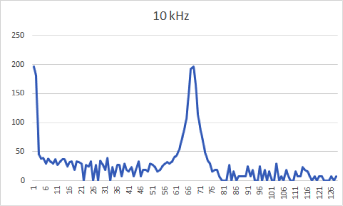

The peak occurs at bin 68, pretty close to the expected bin of 66. Our prescaler was set to 32, giving us an ADC clock frequency of 500  kHz (16 MHz/ 32), and a sampling frequency of 500kHz/13 = 38 kHz. Each bin is about 150 Hz wide, and 10k/150 = 66.

### Part 2: Acoustic Team
The microphones we used came with a built in circuit, show below.

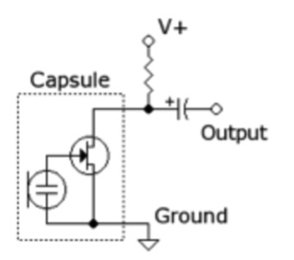

To test the microphone, we hooked it up to an oscilloscope and used an app to generate a 660 Hz tone. The output was a ~612 Hz sinusoid with a ~1 V peak to peak amplitude. 

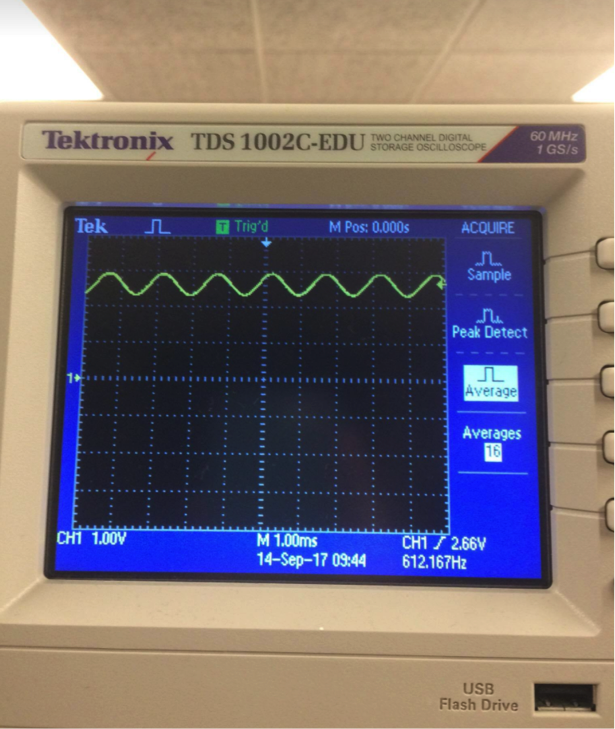

Since we only needed to detect a 660 Hz tone, we can use a smaller sampling frequency. We modified the sample code, setting the prescaler to 64. 

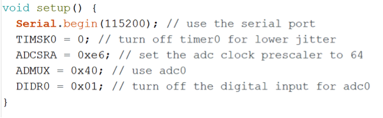

With this sampling frequency, we would expect to see peaks for 585 Hz, 660 Hz, and 735 Hz signals in bins 7, 8, and 9, respectively.

The peaks were actually in bins 5, 6, and 7 respectively. This could potentially be due to inaccuracies in our tone generator.
We also designed a band pass circuit to filter out frequencies below 500 Hz and above 800 Hz, but didn’t think it would be necessary during the competition, since the FFT algorithm neatly sorts the frequencies for us.

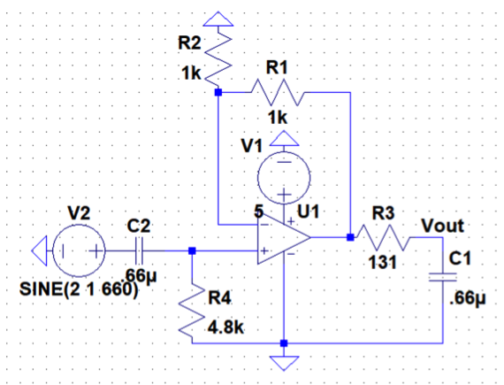

### Part 3: Optical Team
The objective of this part of the lab is to make our robot be able to detect a 7 kHz signal with an Arduino using the FFT library. 

Materials used:

- Arduino Uno
- Breadboard
- Multiple resistors (100Ω-8 ㏀ range)
- Treasure 
- IR receiver (NPN phototransistor)  
- Op Amp (LM 358) 
- Capacitor (3.3 nF)
- Function generator
- Oscilloscope

For this part of the lab, we were assigned to build a circuit to detect electromagnetic radiation of infrared (IR) frequency. In order to achieve this functionality, we needed to use a phototransistor. A phototransistor is a light-sensitive transistor. The one we used in our lab is a photo-bipolar transistor, which is essentially a bipolar transistor encased in a transparent case so that light can reach the base-collector junction. The more light the phototransistor receives, the more current it lets pass. You can see a picture of our phototransistor below.

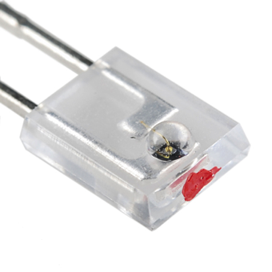

We used a treasure as the transmitter of the IR signal. We first had to make sure our treasure was in fact transmitting at 7 kHz of frequency. Therefore, we tested it using the oscilloscope and adjusted the frequency of the signal through one of the potentiometers embedded in the treasure.   

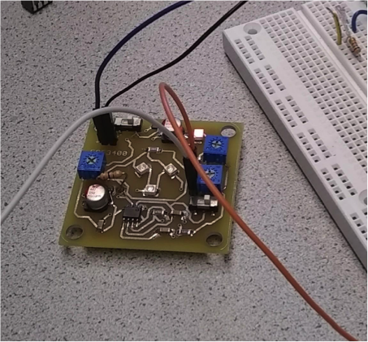

Once our treasure was emitting a signal at the correct frequency, we proceeded to connect our sensor (phototransistor), so we could analyze the signal it was detecting when the treasure was facing at it. The following represents the configuration of the circuit of our sensor. 

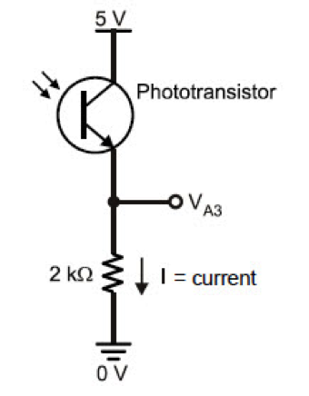

The changing current causes the voltage to drop across the terminals of the resistor. When we measured the value of this voltage, it was in the range of 100 mV. The signal must be in the range of 0 to 5 V so Arduino can process it correctly. Therefore, it was necessary to amplify the signal. We came up with the idea of using a simple non-inverting amplifier where we could obtain the necessary gain by trying different combinations of resistances for R1 and R2. For this part, we used an LM-358 op-amp. The following shows the scheme of the non-inverting amplifier.

The values we used for the resistors were: R1 = 1 ㏀ and R2 = 100 Ω, so our gain was Av = 1 + R1 / R2 = 1 + 100 = 101 approximately. Then we connected the circuit to the Arduino and used the FFT library to measure the voltage (fft_adc_serial). But, when we analyzed the data, we could not see the signal detected by our sensor. Then, we realized that our system was generating a non-trivial DC component that it was causing our amplified signal to go beyond 5V, so Arduino could not correctly detect it. So we decided to add an RC high pass filter to filter out low frequency (DC) signals. The values for the resistor and capacitor were conditioned by the cutoff frequency equation: 

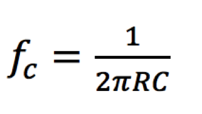

The values we used for the resistor and capacitor were: R = 8 ㏀ and C = 3.3 nF. Therefore, our cutoff frequency was approximately 6 kHz, which guaranteed to eliminate all low frequency DC signals. Then, we put everything together and proceeded to measure the value of the signal again utilizing the same code we used before (fft_adc_serial). 
A picture of our final circuit

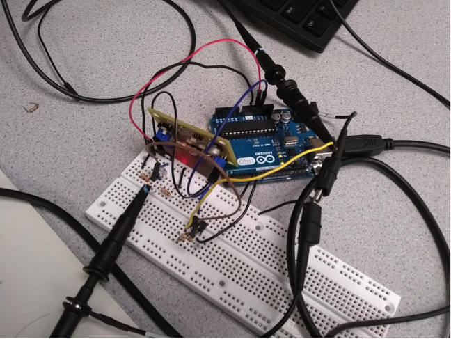

Measurement of the input voltage and the output (amplified) voltage in the oscilloscope

As it can be appreciated in the image above, the signal was correctly amplified. However, we did not receive a perfect sinusoidal signal. We tested our circuit and all parts were working properly; we used a function generator and realized that the problem was associated with the signal generated by the treasure. This signal does not produce a perfect sinusoidal function, which can be problematic for us in the future. This is another challenge we have to take in consideration for Milestone 2 where we have to make our system able to identify not only 7 kHz, but 12 kHz and 17 kHz signals. How can this problem affect us? To figure out the answer for this question, we used the Arduino to collect data from our system in both situations: using the signal generated by the treasure and the signal from the function generator. We expected each bin to be about 150 Hz, calculated from ([16 MHz / 32 prescaler) / 13 clock cycles] / 256 bins. Then, we divided 7 kHz by 150Hz and realized that our signal must be represented by the bin number 46 or 47 approximately. This can be seen in the following pictures:
Graph generated by the data collected using the signal from the treasure:

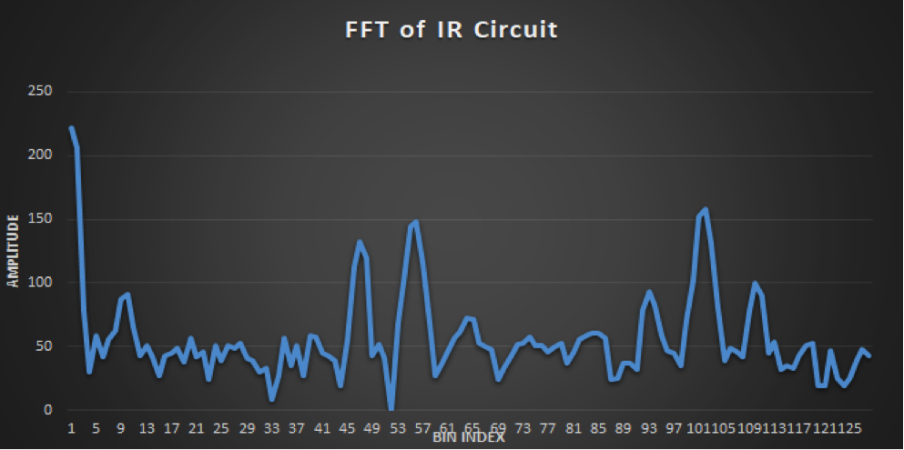

Graph generated by the data collected using the signal from the function generator:

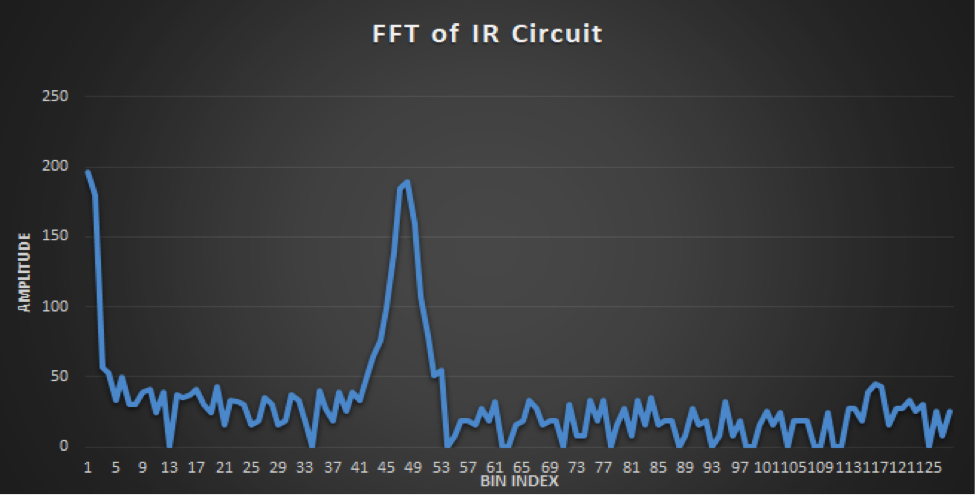

We can see the peak around bin 47 which means that Arduino is detecting the 7kHz signal. However, as it can be seen in the images above, there is a big difference in the data collected from the signal of the treasure and the function generator. In the first one, we can appreciate the appearance of other peaks that can confuse our system, whereas in the second one we can see how the 7 kHz signal stands out from the rest. This warns us about a problematic that we have to solve for Milestone 2. 
Lastly, we added some code in order to differentiate when our system was detecting the desired signal and when it was not . Our code basically prints out the line “Detecting 7kHz signal” when it detects it along with the values. You can see how our system perfectly achieves this task in the following video. 

<iframe width="560" height="315" src="https://www.youtube.com/watch?v=kk23cKls-Po" frameborder="0" allowfullscreen></iframe>

### Conclusion
As we had our robot moving and detect corners, we want to enable the robot to sense its surroundings. In this lab, we worked with a microphone with 660 Hz and an IR sensor to detect signals with different frequency. Both of the acoustic circuits and optical circuits were implemented with amplifiers and filters, which would made it easier to receive information from its surroundings. With these fundamental parts, we can proceed to wall detection and other functions in the future.

>>>>>>> 5edcdc31bd2cde44d95f9bcf8c864b1d59a4858b
