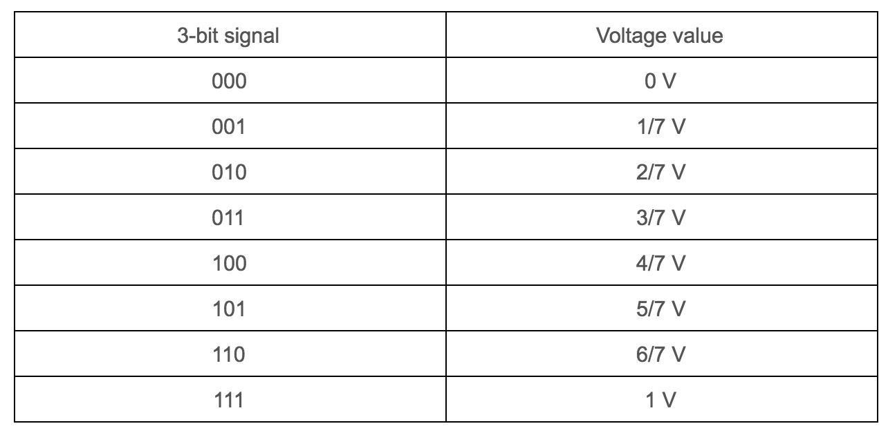
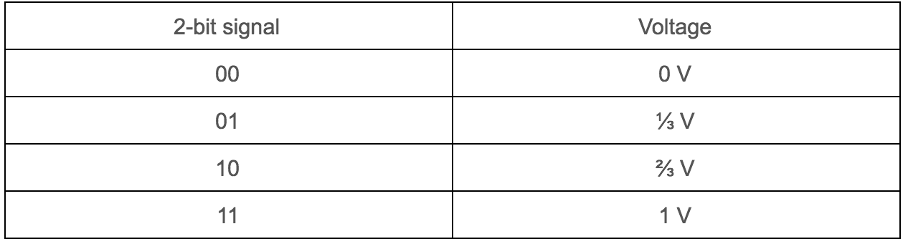
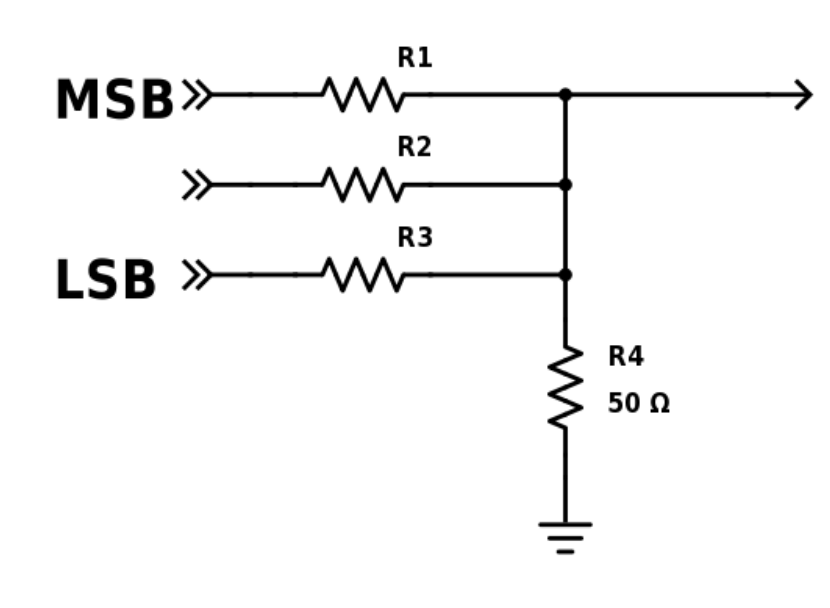
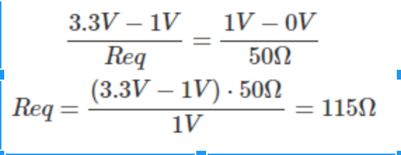
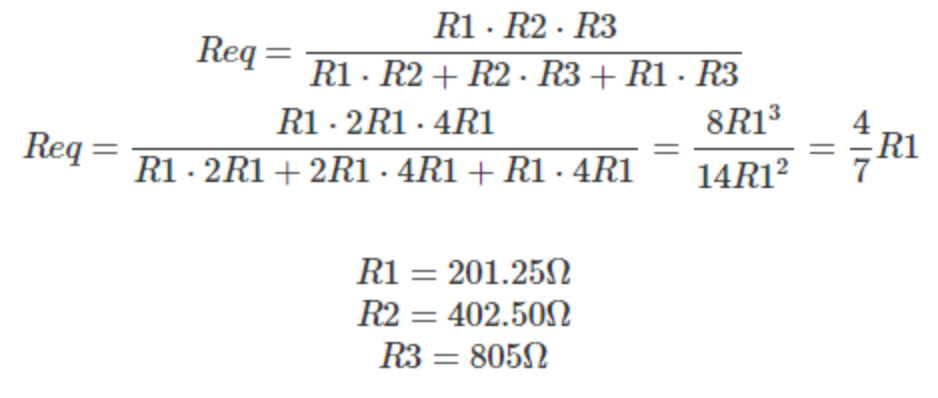
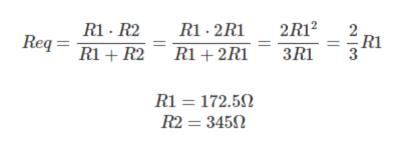
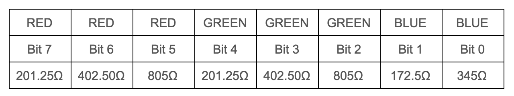

## Lab 3: FPGA Video Controller and Sound Generation

### Objective
This lab activity is divided into two projects. One team must take at least two external inputs to the FPGA and display them on a screen. The other team will react to an external input to the FPGA of their choice and generate a short “tune” consisting of at least three different tones to a speaker via an 8-bit DAC. These two tasks represent a good practice towards the final competition, since all the maze information detected by our robot must be processed by the basestation Arduino, transmitted to the FPGA  and finally drawn on a VGA monitor. Once our robot has completely mapped the maze, the FPGA must generate a short tune to be played on a speaker to indicate that maze-mapping is done. 

### Graphics Team
 Maria Bobbett, Leandro Dorta Duque, Tejas Advait

#### Materials
- 1 VGA Monitor
- 1 VGA Cable
- 1 VGA Connector
- 1 VGA Switch
- Multiple resistors
- 2 external switches

#### Overview
During the final competition, our robot must be able to detect all maze information which will be displayed in a monitor. In order to achieve this functionality, we must construct a communication system that consists of: an Arduino, which processes the information detected and transmits it to an FPGA, and an FPGA which conveys the information to the VGA monitor where it is graphically displayed. A VGA monitor works with two synchronization signals and three analog color inputs (Red Green Blue). It works by looping through all the pixels on the screen as determined by the synchronizing clock signals. In each cycle, the color of the corresponding pixel is determined by the voltage values of the three analog signals. For the completion of this lab activity, we were provided with a VGA module which generates the necessary VGA color signals (8-bit signal: 3 bits for red, 3 bits for green, and 2 bits for blue) and the synchronization signals. This module outputs the x- and y-coordinates for the next pixel and receives as input the corresponding color for this pixel. We have the task to create the logic to determine the color of each pixel location according to what we desire to portray in the screen. Another consideration is that the VGA cable,which serves as the connection between the FPGA and the VGA monitor, only has one wire for red, one wire for green and one wire for blue (analog signals which oscillate between 0 and 1V). To overcome this problem, we use a Digital-to-Analog Converter (DAC) which converts the given 8 color bits (with a 3.3V digital output from the FPGA) to the desired three color analog signals. 

####  How the DAC on the Provided VGA Connectors Works and How the Resistor Values were Chosen
As it was mentioned before, we face the problematic situation that the FPGA outputs 8 color bits with the corresponding 3.3V digital signal and the VGA only contains three wires (one wire for red, one for green, one for blue) to read analog color signals (values oscillating from 0 to 1V). Therefore, we need to come up with a solution to map each possible combination of bits to a different value of voltage in order to differentiate them. For example, for color red and green, we have 3 bits, which correspond to 8 different  bit combinations. We need to map each of these combinations to a different value of voltage. Taking this in consideration, we come up with the following values: 

In this way, we have a corresponding value of voltage to each bit combination. These values apply for red and green. Let’s see the same analysis for blue color:

We can obtain these different values of voltage by applying voltage division as it is showed in the following schematics:
Red and Green Branches Voltage Divider

\n\t\t Blue Branch Voltage Divider

In the schematics above, we have identified the most significant bit by MSB and the least significant bit by LSB. We have also represented the 50 ohm internal resistor of the VGA cable. Now, we have to determine the values for each resistor. Let’s start with the Red and Green Branches: 
 - We first rearrange the schematic so it is easier to apply the node-voltage method. 

 - We are taking the example where all bits are on and the outputs is 1 V (according to the table above). 
 - Then, we proceed with the calculations:
 
 
 
 - From the table corresponding to the Red and Green Branches, we can notice that the value for the bits starting from the MSB to the LSB    are 4/7 V, 2/7 V and 1/7 V respectively. We can conclude that each bit is half of the other. Therefore, the corresponding resistance      for each bit will follow this structure but in the opposite way. So, the order of the resistances starting from the MSB to the LSB will    be R, 2R, and 4R respectively. Taking this in consideration, we are now able to calculate the values of the resistor since we have the    equivalent resistance: 

We apply the same operations to the blue branch:

The following table resumes the obtained results:

These values correspond to the minimum resistance that we need for each bit in its corresponding branch in order to obtain 1V as the maximum voltage for the output of the VGA connector (and the input of the VGA cable). If we use lower values of resistance, the signal will be able to reach values greater than 1V which can be problematic for our VGA monitor. However, we can use higher values of resistance as long as the value for the output signal is between 0 and 1V. Now, let’s analyze the values of the resistors of our VGA connector to see if they meet the requirements: each resistor is approximately doubling the value of its previous bit’s resistance and the value of the final output is between 0 and 1V. 

