## Lab 3: FPGA Video Controller and Sound Generation

### Objective
This lab activity is divided into two projects. One team must take at least two external inputs to the FPGA and display them on a screen. The other team will react to an external input to the FPGA of their choice and generate a short “tune” consisting of at least three different tones to a speaker via an 8-bit DAC. These two tasks represent a good practice towards the final competition, since all the maze information detected by our robot must be processed by the basestation Arduino, transmitted to the FPGA  and finally drawn on a VGA monitor. Once our robot has completely mapped the maze, the FPGA must generate a short tune to be played on a speaker to indicate that maze-mapping is done. 

### Graphics Team
 Maria Bobbett, Leandro Dorta Duque, Tejas Advait

#### Materials
- 1 VGA Monitor
- 1 VGA Cable
- 1 VGA Connector
- 1 VGA Switch
- Multiple resistors
- 2 external switches

#### Overview
During the final competition, our robot must be able to detect all maze information which will be displayed in a monitor. In order to achieve this functionality, we must construct a communication system that consists of: an Arduino, which processes the information detected and transmits it to an FPGA, and an FPGA which conveys the information to the VGA monitor where it is graphically displayed. A VGA monitor works with two synchronization signals and three analog color inputs (Red Green Blue). It works by looping through all the pixels on the screen as determined by the synchronizing clock signals. In each cycle, the color of the corresponding pixel is determined by the voltage values of the three analog signals. For the completion of this lab activity, we were provided with a VGA module which generates the necessary VGA color signals (8-bit signal: 3 bits for red, 3 bits for green, and 2 bits for blue) and the synchronization signals. This module outputs the x- and y-coordinates for the next pixel and receives as input the corresponding color for this pixel. We have the task to create the logic to determine the color of each pixel location according to what we desire to portray in the screen. Another consideration is that the VGA cable,which serves as the connection between the FPGA and the VGA monitor, only has one wire for red, one wire for green and one wire for blue (analog signals which oscillate between 0 and 1V). To overcome this problem, we use a Digital-to-Analog Converter (DAC) which converts the given 8 color bits (with a 3.3V digital output from the FPGA) to the desired three color analog signals. 

####  How the DAC on the Provided VGA Connectors Works and How the Resistor Values were Chosen
As it was mentioned before, we face the problematic situation that the FPGA outputs 8 color bits with the corresponding 3.3V digital signal and the VGA only contains three wires (one wire for red, one for green, one for blue) to read analog color signals (values oscillating from 0 to 1V). Therefore, we need to come up with a solution to map each possible combination of bits to a different value of voltage in order to differentiate them. For example, for color red and green, we have 3 bits, which correspond to 8 different  bit combinations. We need to map each of these combinations to a different value of voltage. Taking this in consideration, we come up with the following values: 

In this way, we have a corresponding value of voltage to each bit combination. These values apply for red and green. Let’s see the same analysis for blue color:

We can obtain these different values of voltage by applying voltage division as it is showed in the following schematics:
Red and Green Branches Voltage Divider

 Blue Branch Voltage Divider

In the schematics above, we have identified the most significant bit by MSB and the least significant bit by LSB. We have also represented the 50 ohm internal resistor of the VGA cable. Now, we have to determine the values for each resistor. Let’s start with the Red and Green Branches: 
 - We first rearrange the schematic so it is easier to apply the node-voltage method. 

 - We are taking the example where all bits are on and the outputs is 1 V (according to the table above). 
 - Then, we proceed with the calculations:
 
 
 
 - From the table corresponding to the Red and Green Branches, we can notice that the value for the bits starting from the MSB to the LSB    are 4/7 V, 2/7 V and 1/7 V respectively. We can conclude that each bit is half of the other. Therefore, the corresponding resistance      for each bit will follow this structure but in the opposite way. So, the order of the resistances starting from the MSB to the LSB will    be R, 2R, and 4R respectively. Taking this in consideration, we are now able to calculate the values of the resistor since we have the    equivalent resistance: 

We apply the same operations to the blue branch:

The following table resumes the obtained results:

These values correspond to the minimum resistance that we need for each bit in its corresponding branch in order to obtain 1V as the maximum voltage for the output of the VGA connector (and the input of the VGA cable). If we use lower values of resistance, the signal will be able to reach values greater than 1V which can be problematic for our VGA monitor. However, we can use higher values of resistance as long as the value for the output signal is between 0 and 1V. Now, let’s analyze the values of the resistors of our VGA connector to see if they meet the requirements: each resistor is approximately doubling the value of its previous bit’s resistance and the value of the final output is between 0 and 1V. 

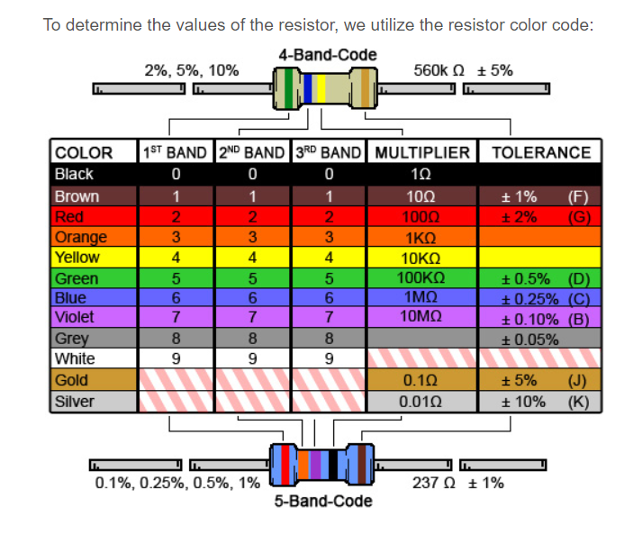

And here is a picture of the VGA connector we use:
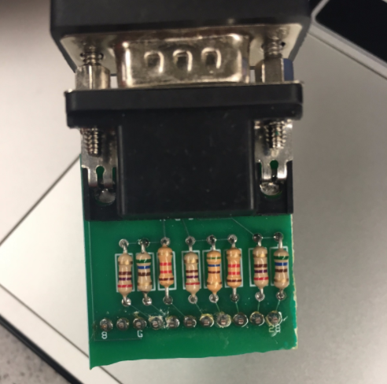

These are the corresponding values:

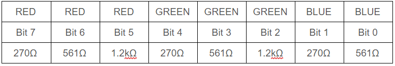

At first sight, we can notice that each value of resistance for each bit is greater than its corresponding in the analysis we did before. Also, they meet the requirement that each value is approximately doubling the value of the previous bit. Let’s make the calculations to see if the values of the output signals oscillate between 0 and 1 V. 

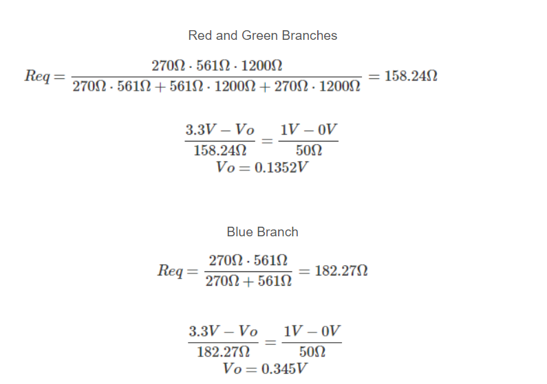

As we can see, the voltage values are between 0 and 1V. Therefore, the values for the resistors are correctly chosen as we analyzed before. 

####  Drawing One Box On The Screen
	Once we understood how the VGA connector worked, we hooked up our FPGA and uploaded the template code. We first set the screen color to purple.
 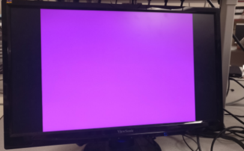
Once we successfully set the screen color, we wrote code to draw an Italian flag in the center of the screen.
 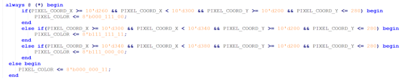
 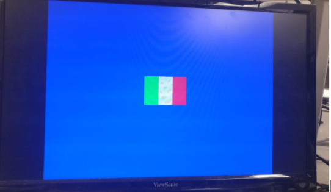
 
### Reading external inputs to the FPGA
#### Correctly updating a 4-bit array dependent on the inputs
In this part of the lab, we connect two external switches to the Arduino Uno and connect the Arduino to the FPGA. The plan is to establish the communication between the Arduino and the FPGA, so the Arduino process the maze information and sends the signal to the FPGA which portrays it into the VGA screen. We connect the two switches to two analog pins in the Arduino in order to read their outputs. Then, the Arduino will send two digital signals (each corresponding to each switch) to indicate if the switch is on or off. Then, the FPGA will output the corresponding graphics for each case. The following corresponds to our Arduino code:
 
 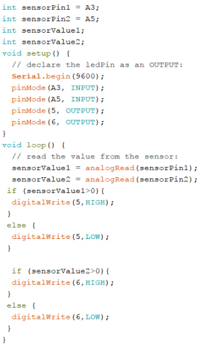
 
 The Arduino output signal is of 5V and the input signal that the FPGA receives is of 3.3V. Therefore, we must step down the signal from the Arduino before connecting it to the FPGA. To achieve this, we use a voltage divider using the values of 1kΩ and 500Ω. 
 
 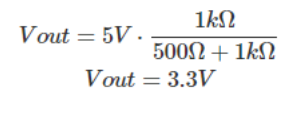
Once we have the appropriate Arduino outputs set up, we can connect them to the GPIO pins in the FPGA. Our FPGA will update the configuration of colors according to the values obtained from the Arduino which indicates the states of the switches. We establish the relations as follow: 
The values for each quadrant correspond to the combination of Switch_1 Switch_2. For example, in order to highlight the top right corner, Switch_1 = 0 and Switch_2 = 1.

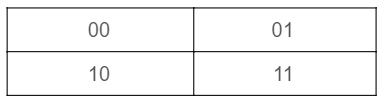

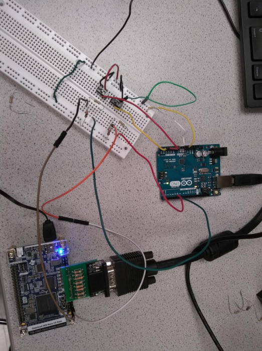

The connection between the switches, the Arduino and the FPGA where you can also see the voltage divider utilized.
The graphics our code portrays on the screen corresponds to a white square which is divided in the four quadrants described above. The selected quadrant according to the values of the switch becomes red, and the rest of the screen  is black. The following corresponds to the code to achieve this functionality: 

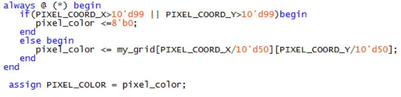

This portion of code updates the color for the next pixel location accordingly. As we want to create a 100-by-100 px square, we establish that any pixel location greater than that will be colored black. Then, if the pixel is within that area, it will receive its color according to the mapping we establish which is described in the next section. 

#### Mapping external inputs to four different outputs on the screen
The following fragment of code shows how we map external inputs to four different outputs. The external inputs, which correspond to the values of the switches are stored by the variables switch_1 and switch_2. Also, we create a grid that (4-bit array) to map each quadrant to its corresponding color according to each situation. We can follow the code to see that it follows the idea we described before about how the relation between the switches and the highlighted quadrant is. 

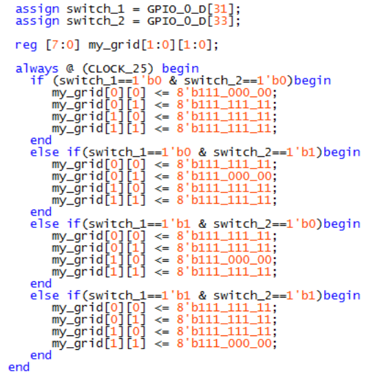

In the following video, we can see how our code successfully works: 
<iframe width="560" height="315" src="https://www.youtube.com/embed/PbsCtGimTn4" frameborder="0" allowfullscreen></iframe>
