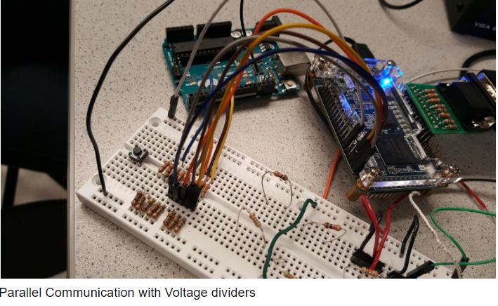
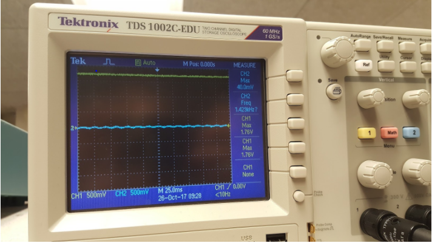
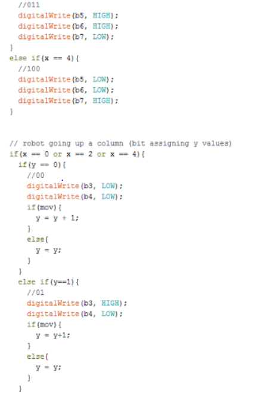
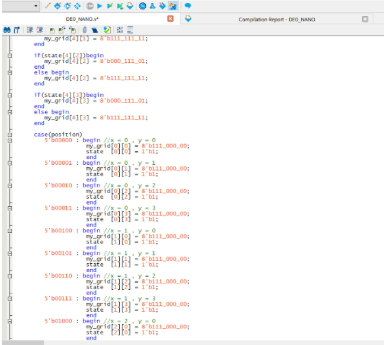
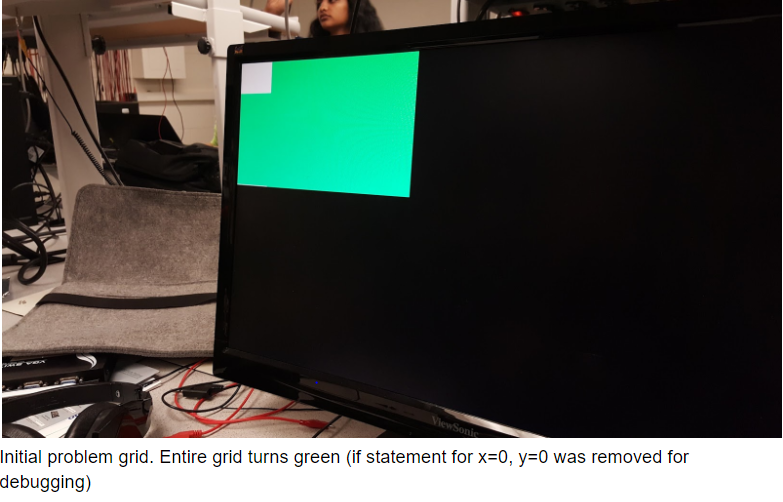
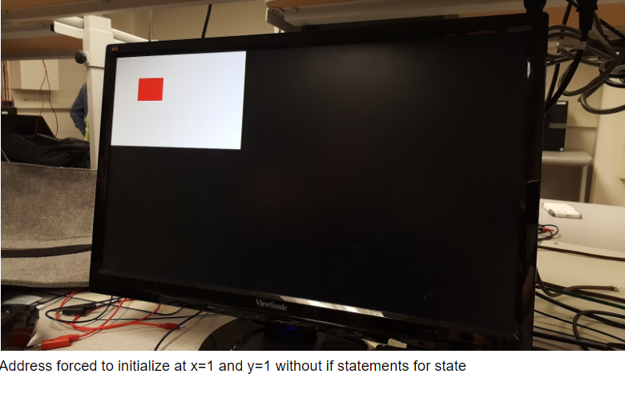

## Lab 4: Radio Communication and Map Drawing

### Objective
For this lab assignment, we split into two groups: one group works on the radio component and another on the FPGA component. For the last portion of the lab, both pieces are combined. The radio team uses the Nordic nRF24L01+ transceivers and the corresponding Arduino R24 library in order to achieve wireless communication between the Arduino at the base station and the Arduino on the robot. At the end of the lab, the team will be able to send messages from one Arduino to the other (simulating actual maze information) and have the FPGA display the received data on the monitor. 

### The Radio Team
Maria Bobbett, Leandro Dorta Duque, Tejas Advait

#### Material
 - 2 Nordic nRF24L01+ transceivers
 - 2 Arduino Unos (one must be shared with the other sub-team)
 - 2 USB A/B cables
 - 2 radio breakout boards with headers
 
 #### Getting Started 
First we downloaded and installed the RF24 Arduino library required to work with the transceiver. The transceivers were soldered apart from the 3.3V supply wire. We soldered the wire and connected the transceiver as shown in figure 1. We also used two different laptops to test and program the sender and the receiver Arduino board.
Next we downloaded the getting started sketch from ECE 3400 lab repository and modified the identifier number for two pipes according to our team number and lab day. 
2*(3D+N) + X ---> 2*(3*2 + 10) + X [D = 2 for Wed Night, N = 10 for team number 10 and X is 0 for one Arduino and 1 for the other]. We get 32 (20 in hex) and 33 (21 in hex)
// Radio pipe addresses for the 2 nodes to communicate.
const uint64_t pipes[2] = { 0x0000000020LL, 0x0000000021LL };
 

### The FPGA Team
Yixuan Wang  Joshua Diaz  Jennifer Fuhrer

#### Material
 - FPGA
 - 1 Arduino Uno
 - 1 VGA cable
 - 1 VGA connector
 - 1 VGA switch
 - Various resistors
 
 #### Overview
Communication between Arduino and FPGA

Before we could implement wireless communication, we needed a reliable scheme of wired communication between the Arduino and FPGA. We chose to implement parallel communication. Despite the fact this form of communication uses several of the pins between the two boards, it simplified the code we needed to write for the two boards and in theory would limit debugging time.

The radio team decided we would need to transmit 8-bit packages between the boards, 3 bits for the x coordinates, 2 bits for the y coordinates, and 3 for the state of the robot and treasure detection. This meant we had to use 8 pins on both boards. We used 0-7 on the Arduino and GPIO_0_D 10-17 for the FPGA. In addition, we needed to create voltage dividers for each pin because the Arduino outputs 5V, but the FPGA inputs up to 3.3V. Using two resistors, one 328 ohms and the other about 177 ohms, we pulled the voltage down outputted by the Arduino to 1.76 volts (when measured on the oscilloscope). 

CH1 is a reading from pin 7 on the Arduino when the program is finished (for the MSB of the x coordinate which is reading 4 or 100)

Once all the inputs and outputs were safely wired up on a breadboard, we wrote code for the Arduino to simulate a robot moving across all the spaces on the grid in a zigzagging pattern. The code started at x=0 and incremented up the y values (from 0 to 3), then once it reached y=3, the x state would increment up to 1, then decrement the y values to 0. This pattern continued until x=4 and y=3 and would stay at that position.

To transmit this information, the Arduino used pins 3 and 4 for the y values (3 LSB, 4 MSB) and 5-7 for the x values (5 LSB, 7 MSB). These were connected to the FPGA GPIO_0_D[14:13] and GPIO_0_D[12:10] respectively. 

Once the information was inputted into these pins, the FPGA reads the numbers as xcoord and ycoord. These values are combined into a single five bit address to be evaluated in a case statement to check whether the robot is currently on this coordinate. Once the robot reaches this coordinate, and subsequent address, the corresponding grid turns red and changes a state bit to 1, meaning the robot has already visited this location. The state variable is a 4x5 matrix, with one bit for each grid square. A 0 indicates the robot hasn’t visited that location and a 1 indicates it has. As previously described, once a robot goes to a location, it flips the state bit to 1. Once this state bit is changed, several if statements evaluate this state bit before the case statement. If the state bit is 0, the grid square is white, if it is 1 then the grid square is green.

With this logic, a red square should travel through the grid in a zigzag pattern, turning all the originally white squares to green as it goes along. However, we had several issues implementing the Verilog code which resulted in undesired outputs. Initially, all our entire grid was initialized green despite us only inputting a single positional value of x=0 and y=0. In addition, if we removed the if statements that evaluated the state, the entire grid would turn red. At this point, we realised this issue is probably with the implementation of address.

Upon advisement, we added a default case to our case statement. However, our single positional value of x=0 and y=0 would still not trigger the desired outcome. The entire grid was white instead. At the present moment, we are still are having problems displaying the correct inputs so we were unable to get past this incorrectly colored maze. Unfortunately we are still in a state of debugging because we are unsure of the exact problem plaguing our code.

