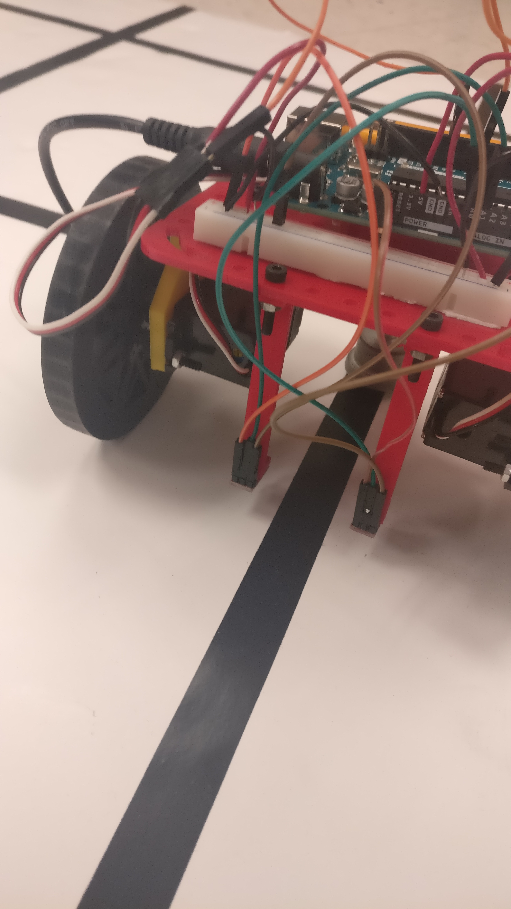
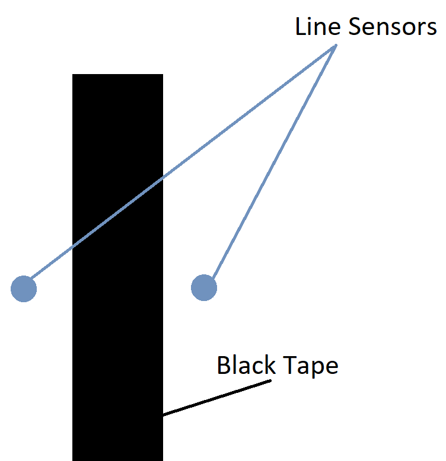
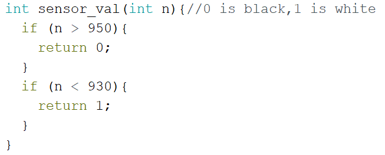
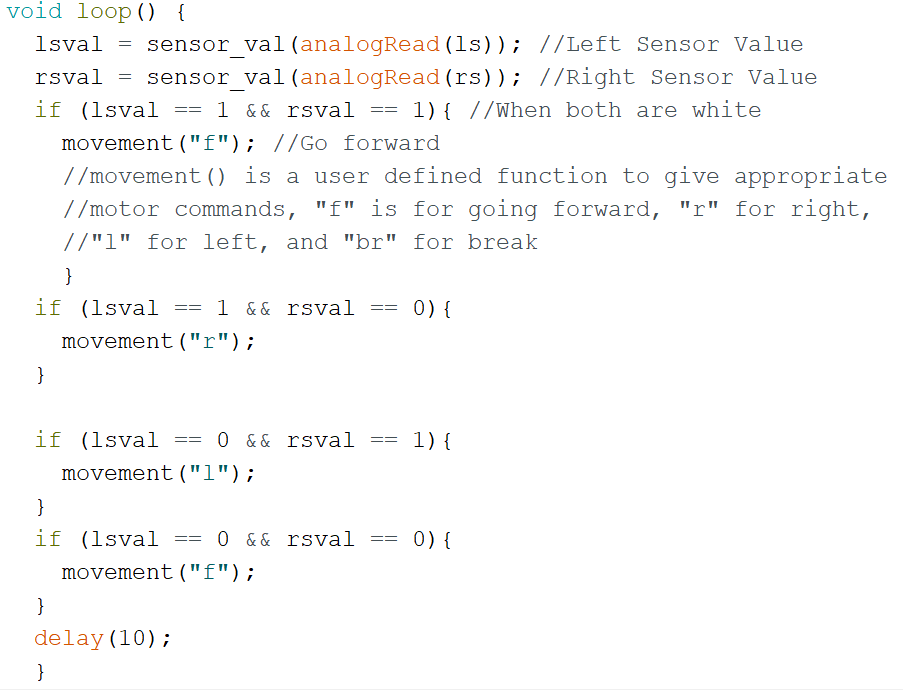
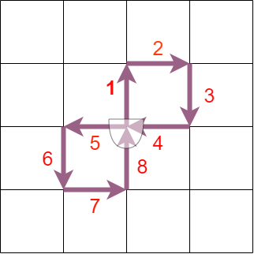
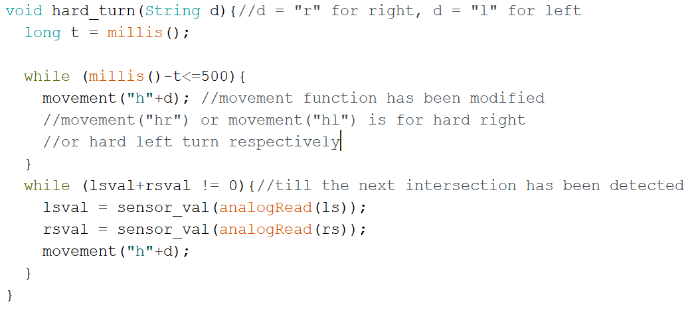

## Milestone 1: Figuring Out Figure 8s
### The Goal

For Milestone 1, we have two primary objectives:
- Successfully implement line following - where black tape on a white background represents the line
- Successfully traverse the grid in a figure eight.

#### Materials

- 2x Continuous Servo Motors
- 2x [Analog Line Sensor](https://www.sparkfun.com/products/9453)
- Arduino Uno
- Robot Chassis
- 9V Battery
- Breadboard
- Appropriate Connectors and Headers

### Line Follower
Since our servo motors were calibrated fairly well in Lab, our robot moves in a straight line on the grid, with minimum need for correction.
We attach two sensor at the front of the robot (from Lab 1) as shown below 

We start working on milestone 1 by first testing and calibrating the line sensors. Using the example code, “AnalogReadSerial” in the Basic category, we observed the analog values generated by the sensor when kept on differently colored surfaces. We concluded that a value above 950 corresponds to black color while a value less than 930 corresponds to white color. Any value in between is considered noise since there is no single precise value which distinguishes black tape from the white background.

Now, after establishing the threshold values, we worked on the logic for line following. Our sensors are positioned such that it fits the line in between. If both the sensors detect white, that means the robot doesn’t need any corrective measure, so the robot goes straight. If the left line sensor detects black and the right sensor detects white, then the robot should correct itself by turning a little left. Similarly, when the right line sensor detects black and left line sensor detects white, the robot should correct itself by turning a little right. If both detect black, for the purpose of line following, we program the robot to go straight; however, this would change for the next objective! 
This simple logic is enough to successfully implement line following. 
The following code takes in raw sensor and returns 0 or 1 depending on the threshold values. 

The following code explains the logic for line following in terms of code  

And here’s the video of our line follower robot: 

<iframe width="560" height="315" src="https://www.youtube.com/embed/UeX_rniHqjw" frameborder="0" allowfullscreen></iframe>

### Figure Eight

The diagram below depicts how we want our robot to move. 

 

The number on the arrows indicate the path of the robot, i.e, “1” is the first movement followed by “2” and so on. The circle represents the robot and its starting position. The flat end represent the front side of the robot.
Now this task requires us to tackle two challenges: detecting an intersection and making a right angled turn, either to the left or to the right. Once these two challenges are tackled, we can program the robot to drive in any pattern on the grid.
The first challenge can easily be solved by using the existing two sensors. When both the two sensors detect black, then this corresponds to an intersection. Once the robot arrives at an intersection, it has to decide whether to go right, left or forward. The code for going forward is trivial; however the code for making a right/left turn is a challenge. We tackle this challenge in the following way: 

1. Once the robot arrives at an intersection, it makes an initial small turn in the desired direction (right/left) using differential drive, for a small time t0. Within time t0, the robot doesn’t complete its right angle turn, but covers only a small angle.

2. Once the small turn is over, the line sensors have been displaced from their initial position, i.e, they are no longer on top of the intersection. The robot now turns in the same direction until the sensors detect an intersection.

In this way, the robot completes its right angled turn in the desired direction. The time t0 doesn’t really depend on the speed of the motors since the function of the small turn is simply to displace the sensors from their initial position. For our robot, we set t0 = 400ms. As mentioned earlier, since our robot moves in a straight line due to the calibration of servo motors in Lab 1, an accurate right angled turn can be completed with the help of the two existing sensors.  

Now the Arduino board can be coded in order to carry out the figure eight movement of the robot easily by indicating the robot’s movement command (forward/left/right) for the next intersection. 

The following code is used for making a right angled turn (called hard turn in the code). 

Now, we can combine our code to tell the robot to go
1. Forward
2. Right
3. Right
4. Right
5. Forward
6. Left
7. Left
8. Left
 
Also, obviously the robot is following the line all the while. 
And here’s the video of the robot moving in a figure eight:  

<iframe width="560" height="315" src="https://www.youtube.com/embed/MaJhGQ_WBlU" frameborder="0" allowfullscreen></iframe>

### Future Possible Modifications / Notes
- We can possibly incorporate a four sensor arrangement for better control; however, our current iteration works well
- If there is a change in the chassis, the threshold values for the line sensors have to be tested again
- We will work on a voltage isolator circuit in order to provide separate power supplies to the Arduino Board, line sensors, and servo motors. 

### Conclusion
We successfully added line following functionality to our robot from Lab 1. Building further on the line follower robot, we added the functionality of making right angled turns. Using line following and the ability to make right angled turns, we further programmed the robot to move in a figure eight 

### Challenges
Sometimes the Arduino resets in between the run. We suspect this happens because of too much current drawn by the line sensors and the servo motors from the Arduino board. Hence, we are exploring ways of isolating voltage.  

 
[1. Milestones](milestone.md)  
[2. Labs](labsessions.md)  
