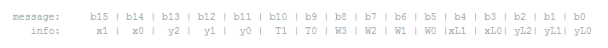
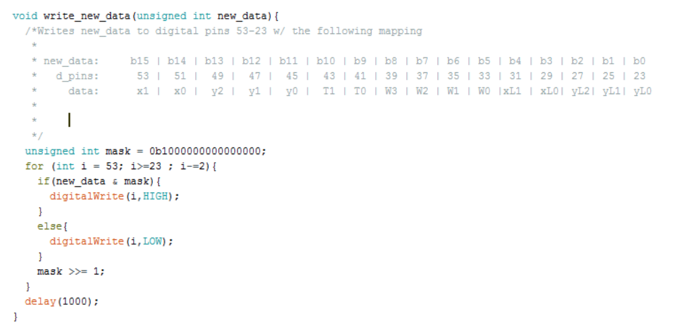
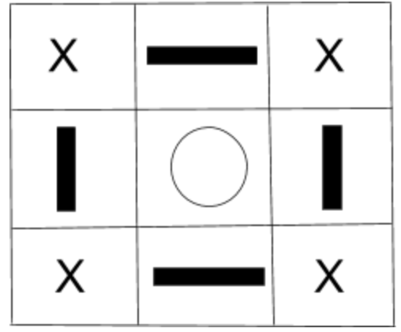

## Milestone 4
Team Members: Tejas Advait, Leandro Dorta Duque, Maria Bobbett, Joshua Diaz, Jennifer Fuhrer, Dean Wang

### Navigation Algorithm
We finally implemented the algorithm described in Milestone 3 which we have tested it and it seems it works fine, but our biggest problem is that the robot is not correctly following it due to mechanical issues. We tested all sensors and they seemed to be working fine and that the threshold values we had established for each of them were correct. The biggest issue is when the robot turns around, it does not end up in a correct position to continue mapping the maze (it does not end up with the black line between the line sensors). We have tried different approaches to fix these problems but we haven’t been able to solve them. We tried to add more sensors but the chassis we are utilizing does allow us to place two more line sensors because of a problem of space. Also, we have recently experienced some problems with the Arduino board: in occasions, it shuts down. We tested the batteries and all connections to check if there was a short circuit but everything seems fine. We are not really sure what the problem is. 

<iframe width="560" height="315" src="https://www.youtube.com/embed/Mnr-MJBWES8" frameborder="0" gesture="media" allowfullscreen></iframe>

### Base Station
The base station requires communication with both the arduino mounted on our robot, and the FPGA driving our display. The robot carries an Arduino Uno that communicates via radio 4 important pieces of information:
    1. The arduino’s current x and y coordinate on the grid (position)
    2. Whether the robot’s current position contains any of 3 types of treasures
    3. Which sides of the robot are blocked by walls, if any
    4. If the robot has finished mapping the maze
Each of these pieces of information are determined locally on the robot and packed into a 11 bit message using bit shifting according to the following scheme:

This was chosen to allow:
    2 bits for the X-coordinate
    3 bits for the Y-coordinate
    2 bits for the 3 different treasures and a state for no treasure
    4 bits for walls (NESW)
    5 extra bits for the previous position

These last 5 bits will be handled by the base station and thus, will just have zeros sent in the robot message.

Because the Arduino Uno does not contain enough pins to output a 16 bit signal (in parallel), the team chose to upgrade our basestation to an Arduino Mega, allowing for enough pins to output all of the desired information.

Our base station arduino then runs the following code to allow the outputs to come from the bottom row of the Arduino Mega.

Because the output from the Arduino Mega comes at 5 volts which will kill the FPGA, every pin will have to be connected to a voltage divider, the output from which can be connected to the FPGA (at < 3.3 V). The pins on the Arduino Mega were then hooked up to the first 16 available(not grounded or constantly powered) GPIO_In Pins on the FPGA.

### VGA Display
We have revised our Verilog code to map treasures and walls, and show the visited, unvisited, and current locations. We used a 9x11 matrix to keep track of the locations of all of the found walls and treasures, as well as visited intersections. The image below shows an example 3x3 matrix for one intersection. The intersection is represented by a circle, the bars represent walls, and the X’s are locations we don’t care about in the matrix (we don’t need them to map the maze). 

Sample Code:

	//xcoord ycoord are the current x and y sent from the robot
	//resized to indicate the right x and y in the maze matrix
	maze_x <= 2*xcoord + 1; 
	maze_y <= 2*ycoord + 1;
			
	maze_xlast <= 2*x_last + 1;
	maze_ylast <= 2*y_last + 1;

    treasure[xcoord][ycoord] <= GPIO_1_D[20:19]; 
		
	maze[maze_x][maze_y-1] <= north; 
	maze[maze_x][maze_y+1] <= south;
	maze[maze_x+1][maze_y] <= east;
	maze[maze_x-1][maze_y] <= west;
		
	//set the last square visited, since it used to display current position
	if(treasure[x_last][y_last]==2'b00) begin //no tresure
		maze[maze_xlast][maze_ylast] <= 3'b001; end //set as visited
	else if(treasure[x_last][y_last]==2'b01) begin //treasure 1
		maze[maze_xlast][maze_ylast] <= 3'b010; end //set as treasure 1
	else if(treasure[x_last][y_last]==2'b10) begin //treasure 2
		maze[maze_xlast][maze_ylast] <= 3'b011; end //set as treasure 2
	else if(treasure[x_last][y_last]==2'b11) begin //treasure 3
		maze[maze_xlast][maze_ylast] <= 3'b100; end //set as treasure 3
			
	maze[maze_x][maze_y] <= 3'b101; //set as current position

We were able to get this scheme working for a 2x2 grid. The arduino sends the FPGA current position, last position, wall, and treasure information. In this video, the “robot” (arduino is spoofing data) is traversing the grid, starting at (0,0), counterclockwise until it reaches (1,0). Walls are on the perimeter of the maze, and there are different frequency treasures at (0,1) and (1,1). Green represents visited, red represents current position, and white represents unvisited.

<iframe width="560" height="315" src="https://www.youtube.com/embed/Lm79gOhD4ec" frameborder="0" gesture="media" allowfullscreen></iframe>

We are still debugging the code for the final 4x5 grid, and are having a few issues with current position that are stumping us.

### Treasure Detection
We revamped our treasure detecting circuits so that we’d be able to detect the treasures from farther distances and soldered them, but were not able to integrate them yet as we are still working out other kinks.
